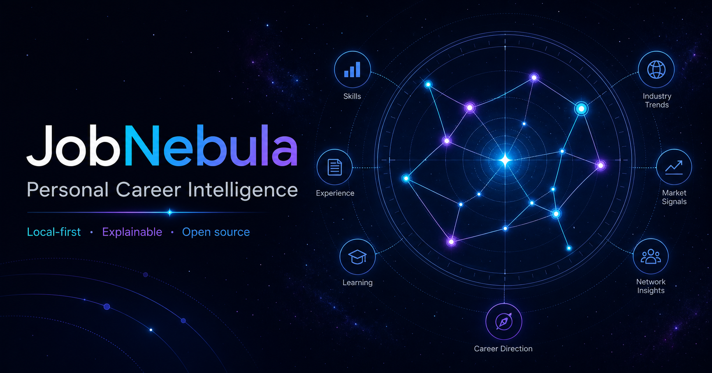
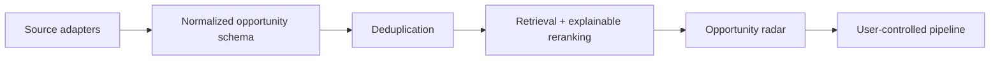

# JobNebula

[](https://github.com/WonderfulClaire/JobNebula/actions/workflows/ci.yml)
[](LICENSE)
[](https://github.com/WonderfulClaire/JobNebula#quick-start)



> Turn scattered opportunities into your career constellation. 把散落的机会聚成你的职业星图。

JobNebula is an open-source, local-first opportunity radar for focused job searches. It turns fragmented listings into an explainable workspace: collect, normalize, rank, review, and move promising roles into an application pipeline.

**Run it locally** (see Quick start) — JobNebula is a local-first app with browser-local persistence, so there is no hosted demo to sign in to; just clone and `npm run dev`.

## Why it exists

Good roles are scattered across company career pages, recruiting platforms, communities, newsletters, and referrals. Generic feeds optimize for volume; candidates need relevance, provenance, and a workflow they can trust.

JobNebula's north star is **explainable relevance**. A fit score is useful only when the user can see the matching signals, gaps, and source behind it.

## Current capabilities

- Three personal career tracks: frontier AI, quantitative finance, and entrepreneurship, each with its own skill profile
- Opportunity radar covering jobs, internships, graduate programs, accelerators, and competitions
- Track switcher plus search, high-fit, remote, and saved filters
- Explainable 0–100 fit scores with positive signals and gaps, scored against the active track
- Future-empowerment roadmap per track: readiness percentage, milestone states, and next actions
- Save, dismiss, and move-to-application actions
- Manual opportunity capture assigned to a track and opportunity type
- Browser-local persistence
- Responsive Chinese interface

> The MVP does not crawl external sites or make hiring decisions. It is a product prototype for user-controlled opportunity intelligence.

## Quick start

Requirements: Node.js 22.13+

```bash
git clone https://github.com/WonderfulClaire/JobNebula.git
cd JobNebula
npm ci
npm run dev
```

```bash
npm run check   # lint, production build, and product-contract tests
```

## Product principles

1. **Provenance first** — retain the original source and posting context.
2. **Explain the score** — show signals, conflicts, and missing information.
3. **Human decision** — ranking assists the candidate; it never decides for them.
4. **Precision over auto-apply** — protect attention instead of maximizing application volume.
5. **Permission-aware sources** — prefer official APIs, feeds, user-provided links, and explicitly permitted public sources.

## Architecture direction



The current demo implements the radar and pipeline locally. The next stage introduces explicit source adapters and portable data formats before any background automation. Unsupported scraping and blind auto-apply flows are out of scope.

See [Architecture](docs/ARCHITECTURE.md) for the planned boundaries.

## Responsible use

- Do not use JobNebula to infer protected traits or automate employment decisions.
- Do not store credentials or sensitive resume data in source adapters.
- Keep scores explainable and allow users to override every ranking/action.
- Respect source terms, robots policies, rate limits, and applicable law.

Please report vulnerabilities through [GitHub's private security advisory flow](SECURITY.md).

## Roadmap

- [x] Multi-track profiles (frontier AI / quant finance / startup) with per-track scoring
- [x] Opportunity kinds beyond jobs: internships, graduate programs, accelerators, competitions
- [x] Per-track empowerment roadmap with milestone states and next actions
- [ ] Resume and preference onboarding
- [ ] Extensible source-adapter interface
- [ ] Duplicate detection across sources
- [ ] Embedding retrieval plus explainable reranking
- [ ] Saved searches and daily digest
- [ ] Application timeline and reminders
- [ ] Browser extension for user-initiated capture
- [ ] Portable JSON/CSV import and export

## Contributing

Contributions are welcome, especially source adapters with clear permissions, ranking evaluation fixtures, accessibility improvements, and internationalization. Read [CONTRIBUTING.md](CONTRIBUTING.md) before opening a pull request.

## License

[MIT](LICENSE)
